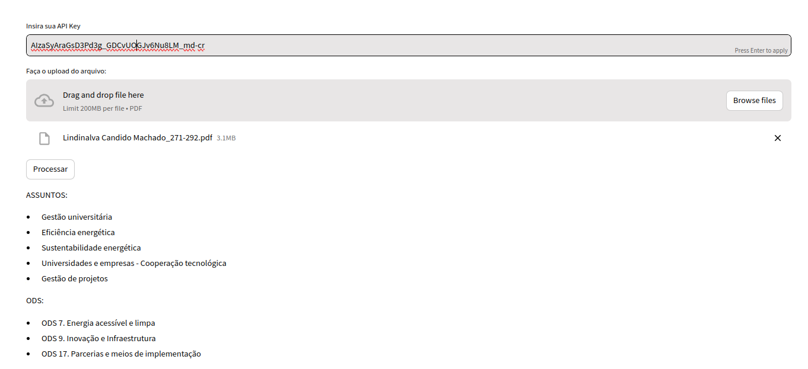

# Classificador de Assuntos e ODS

## Descrição

O **Classificador de Assuntos e ODS** "IAGeraTemas" é uma aplicação que utiliza inteligência artificial generativa para identificar e gerar os principais assuntos e Objetivos de Desenvolvimento Sustentável (ODS) de documentos em formato PDF. A ferramenta é projetada para facilitar a análise de textos, proporcionando uma compreensão rápida e precisa dos temas abordados, com base nas diretrizes do campo 653$a do MARC 21.

## Funcionalidades

- **Identificação de Assuntos**: A aplicação analisa o documento e retorna os 5 assuntos mais relevantes em português.
- **Classificação de ODS**: A aplicação identifica de 1 a 3 Objetivos de Desenvolvimento Sustentável pertinentes ao conteúdo do documento.
- **Interface Intuitiva**: Utiliza o Streamlit para criar uma interface amigável e fácil de usar.

## Tecnologias Utilizadas

- **Python**: Linguagem de programação principal.
- **Streamlit**: Biblioteca utilizada para criar a interface web.
- **PyPDF2**: Biblioteca para manipulação de arquivos PDF.
- **Google Generative AI**: API para processamento de linguagem natural e geração de conteúdos.

## Como Usar

1. Insira sua APIKey
2. Faça o upload do documento (PDF com OCR)
3. Clique no botão processar

## Estrutura do Projeto
- app.py: Script principal que contém a interface Streamlit.
- gerador.py: Script que contém a classe GeradorAssuntoODS, responsável pelo processamento dos documentos e interação com a API do Google Generative AI.
- requirements.txt: Arquivo com as dependências do projeto.

## Contribuição
- Faça um fork do projeto.
- Crie uma nova branch (git checkout -b feature/SuaFeature).
- Commit suas alterações (git commit -am 'Adicione SuaFeature').
- Faça um push para a branch (git push origin feature/SuaFeature).
- Abra um Pull Request.